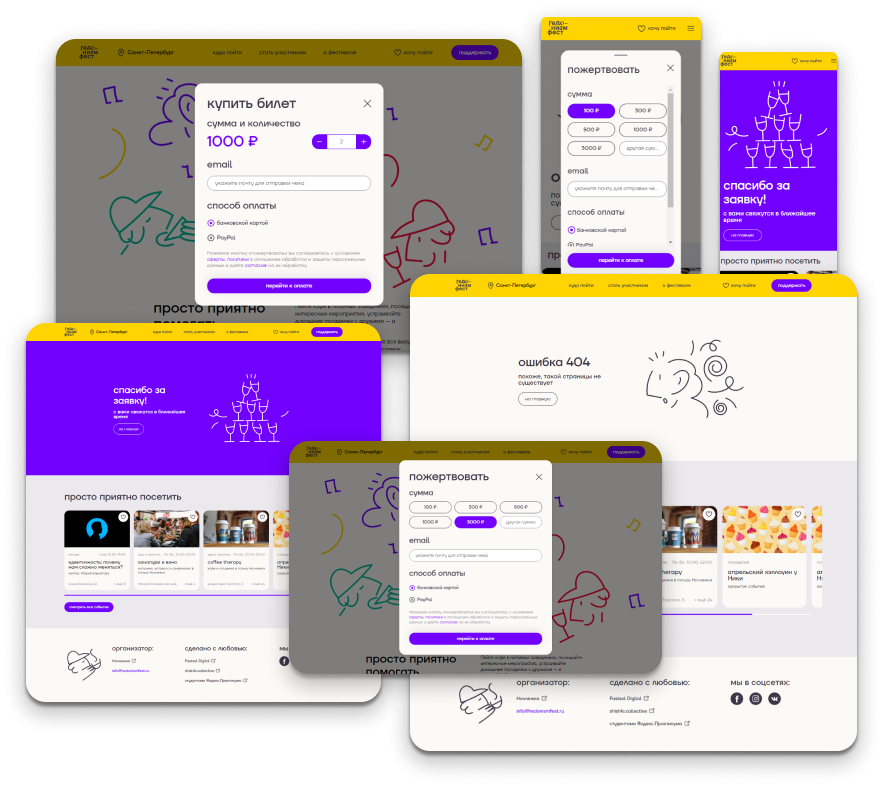

#  Проект «Гедонизм-фест»

**[Ссылка на основной проект](https://basicallyempty.github.io/nochlezhka/)**
**[Ссылка на часть проекта, выполненную командой в данном репозитории](https://geniav.github.io/nochlezhka/)**

**ЦЕЛЬ**
Основная цель проекта – поработать в команде, попрактиковаться с git, поработать с ветками, пулл реквестами, сделать несколько заданий по верстке и доработать функционал.

**ОПИСАНИЕ**
Групповой учебный проект, где командой из 5 человек сделаны попапы, настроен их функционал, сделаны несколько страниц для проекта, проработан адаптив.

**STACK**

HTML, CSS, JavaScript.

**CОСТАВ КОМАНДЫ**

Евгения Верховцева **(GeniaV)**
Андрей Ситников **(AndreySitnikov34)**
Александр Стрельцов **(AlexanderStreltsov)**
Сергей Анохин **(SergeiAnokhin)**
Виктор Степанов **(Vi201951)**

**ЗАПУСК ПРОЕКТА**

   | Вариант | Описание |
| ------ | ------ |
| 1 | запуск из папки проекта _(файл index.html)_ |
| 2 | запуск в VSCode при помощи расширения [LiveServer](https://marketplace.visualstudio.com/items?itemName=ritwickdey.LiveServer) |
